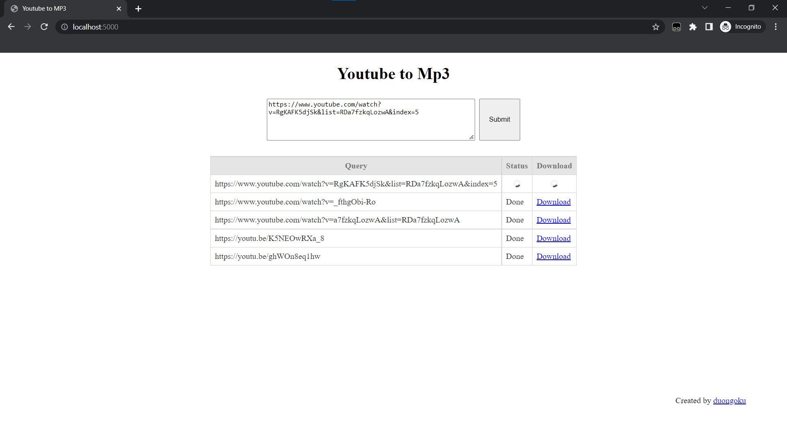
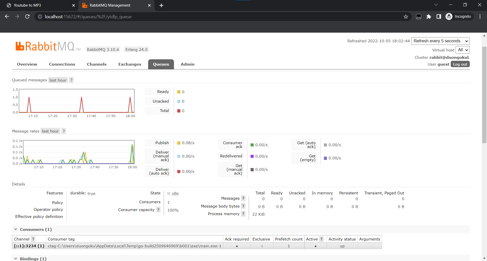
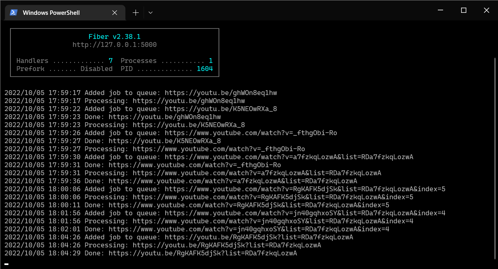

# youtube-to-mp3-INT3105

A web server for hosting a website where you can convert youtube url into mp3 files using [Go](https://go.dev/) and [RabbitMQ](https://www.rabbitmq.com/)

## Prerequisites

-   [Go](https://go.dev/dl/)
-   [RabbitMQ Server](https://www.rabbitmq.com/download.html) running on port 5672 (default port)
-   [yt-dlp](https://github.com/yt-dlp/yt-dlp) ready to run in the command line

## Installation

-   Clone this repository
-   Run the following command to install all required packages
    ```bash
    go get .
    ```

## Run

-   Run the following command to start the server
    ```bash
    go run main.go
    ```
-   Open your browser and go to [http://localhost:5000]

## Preview

Main Screen:


RabbitMQ Control Panel:


Logging:


## Credits

Some css styles are inspired by https://codepen.io/tomhodgins/pen/QEwvEK and https://www.w3schools.com/howto/howto_css_loader.asp

## License

This project is licensed under the GNU General Public License v3.0 - see the [LICENSE](LICENSE) file for details
